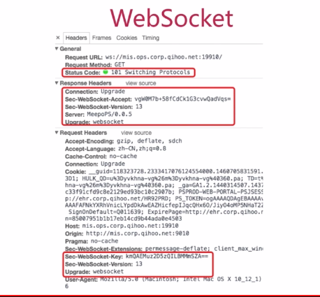

# php构建即时通讯应用

##涉及概念
	
* TCP				传输层协议
* Http				应用层协议 	基于Tcp
* WebSocket			应用层协议	基于TCP
* 长链接				建立一个链接，持续的去使用它
* Socket			封装了TCP的一个接口，是一个工具
* 常驻内存			程序在运行之后一直在内存中，像nginx，apache
* Telnet			linux工具，检测TCP是否正常
* 事件机制			轮询机制
* 后台服务			同常驻内存一样
* 守护进程			保证后台服务稳定运行
* github			代码托管平台
* MeepoPs			开源框架，纯php开发，高效的PHP Socket服务	

##TCP
1.OSI七层模型中第四层，传输层通信协议，位与IP层上、会话层下

2.面向连接的、可靠的、基于字节流的
	
	数据无丢失、数据无失序、数据无错误、数据无重复。
	***流式数据
	
3.建立链接需要三次握手

#Socket
网络上的两个程序通过一个双向的通信链接，实现数据的交换，这个链接的一端称为Socket，也叫套接字

###Socket本质：

1、一个工具、一个接口

2、封装了 TCP/IP 协议

3、建立长链接的基础

	Socket起源于unix，一切皆文件，Socket是一种 打开、读写、关闭的模式。
	服务器和客户端各自维护一个文件，在建立链接打开后，
	可以向自己文件写入内容，供对方读取，或者读取对方所写入的内容，
	通讯结束时，关闭文件。

	Socket机制就像我们打电话一样，一般用户只能感受到本地自己的电话和对方的电话号码，
	其他一概不知。建立通话的过程，语音传输的过程，以及整个通话系统的技术细节，都是不可见的。

###Socket的流程
	Socket实质上提供了进程通讯的端点，进程通讯之前，双方首先必须，
	各自创建一个端点，否则无法建立链接，并相互通讯

根据链接启动的方式，以及本地套接字的链接目标，套接字的链接过程，可以分为3个步骤：

*	服务器监听
*	客户端请求
*	连接确认

####服务器监听
	服务器套接字并不定位具体的客户端套接字，而是处于连接等待的状态
	实时监控网络状态，
####客户端请求
	由客户端的套接字，提出链接请求，要连接的目标是服务器套接字，为此，
	客户端的套接字，必须要描述他要连接的是哪个服务器的套接字。例如：
	指出服务器端套接地址、端口，然后就可以向服务器端套接字请求链接。
####连接确认
	服务器端套接字 监听到 或者说是 接收到 客户端连接的套接字请求时，就
	响应客户端套接字请求。建立一个新的线程，把服务器端套接字的描述发送
	给客户端，一旦客户端确认了此描述，链接就建立好了。而服务器端套接字
	继续处于监听状态，等待接收其他客户端的请求。

#HTTP
	TCP协议之上，短连接（请求，连接，拿到信息，断开），通常监听TCP的80端口。是一个请求响应的协议。
	
	服务器端不能主动与客户端联系，也不能给客户端发出一个回调链接
	客户端与服务端都可以提前中断一个链接。

	HTTP协议是无状态的。同一个客户端的请求，本次和上次的请求是没有任何对应关系的，
	对于服务器来说，他并不知道两个请求是否来自同一个用户。
	HTTP引入Cookie机制来维持链接的可持续状态

	HTTP由两个部分组成。header和body。

#Webserver的工作流程

webserver：web服务器，如：nignx、apache
	
	先建立一个socket,然后绑定一个ip和协议。
	开始监听等待客户端的链接，
	如果有客户端的链接，服务端接收链接，客户端再给服务端从这个链接中发送请求数据
	服务端进行处理，返回给客户端

#WebSocket
	WebSocket是html5的新协议，应用层协议
	主流即时通讯协议
	借助HTTP协议完成握手
	
##WebScoket协议实现即时服务两大好处

	1.相互沟通的header只有两个字节
	2.server push，有了新数据时，主动推送给客户端。
	

